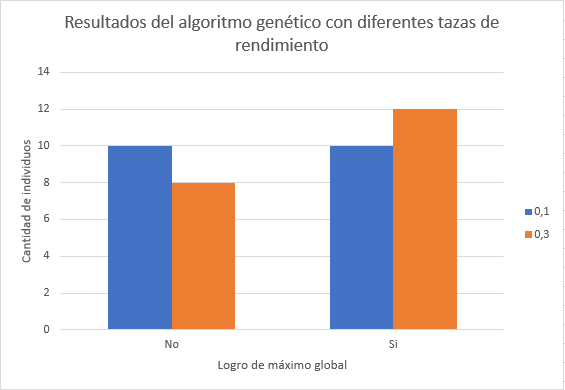

# Proyecto Corto#2-3 - Buscador de Zanahorias
## IC-6200 Inteligencia Artificial
## Integrantes:

* Brayan Fajardo Alvarado - 201157035
* David Gómez Vargas - 2015028430
* Luis Edward Rodríguez Varela - 2014082498


### I Semestre 2018</h3>


## 1. Introducción

Los algoritmos de búsqueda son métodos que permiten encontrar de una manera eficiente un camino que permita llegar a un elemento, posición o lugar.

Dichos algoritmos son utilizados para resolver problemas de ruta más corta para un transporte, cálculo del dezplazmiento que debe hacer una persona para moverse de un punto a otro, y muchos más.

Algunos de los algoritmos para el cálculo de la ruta más corta se encuentran: Dijkstra, algoritmo a* y algoritmos genéticos.

Para efectos de investigación, se realizará un proyecto que pretende estudiar y analizar la realización y pruebas del algoritmo a* y algoritmo genético, aplicado al problema de que un conejo debe buscar zanahorias en un campo de dimensiones definidas.

## 2. Descripción del Problema

Se procesarán tableros rectangulares representados como archivos de texto que contendrán un conejo y múltiples zanahorias.

El objetivo primario de cada corrida de programa será que el conejo encuentre una cierta cantidad de zanahorias.

Tanto para el algoritmo A* como para el algoritmo genético, se definen ciertos requerimientos que se verán ampliamente en cada sección de los algoritmos.

## 3. Algoritmo A*

Este algoritmo es una modificación del algoritmo Dijkstra, el cual posee la variante de tener una función de costo heurístico que permite la distancia más corta para llegar a un punto.

Algunos puntos clave acerca del funcionamiento del algoritmo son:

* Se debe mover el conejo un paso a la vez.
* El conejo se puede mover hacia arriba, abajo, izquierda o derecha únicamente.
* El conejo posee una distancia de visión según se establezca en el programa.
* Se posee un acumulado de pasos o distancia recorrida.
* El conejo recolecta una cantidad predefinida de zanahorias, no necesariamente todas las que hayan en el campo.


#### 3.1. Diseño del algoritmo
El diseño del algoritmo posee los siguientes componentes:

* **Función heurística _(hx)_**: Es una función que define un valor heurístico óptimo, el cual define un costo real para alcanzar el objetivo.
* **Función de costo _g(x)_**: Es el costo o peso que hay para llegar a un cierto nodo o posición. Para este algoritmo, el costo es
* **Función de valor _f(x)_**: Es la suma de _g(x)_ con _h(x)_, que permite escoger a cual nodo acceder para obtener la ruta más corta para llegar a un punto.

#### 3.1.1. Diseño de función heurística _(hx)_
La función heurística es un valor que se asigna a cada elemento o nodo en una matriz, es decir, la estructura que define la ubicación de las zanahorias y del conejo en el campo.

#### 3.1.2 Funcionamiento del algoritmo
El algoritmo comienza localizando el conejo en el campo. Luego, se verifican los nodos o posiciones vecinas a las cuales se puede dezplazar el conejo, y además comprobar si hay zanahorias cercanas.
Dichos nodos vecinos son almacenados en una lista, y por cada uno de ellos se calcula la función _f(n)_, la cual es la suma de _g(n)_ con _h(n)_.

Después de calcular _f(n)_, se verifica cual nodo posee el menor valor y se cambia la posición del conejo hacia ese nodo, manteniendo un acumulado del recorrido realizado. Después se verifica nuevamente los vecinos actuales, se calcula f(n) por cada uno de ellos y se verifica cual posee el menor valor, y así hasta encontrar una zanahoria.

Cuando se encuentra una zanahoria, se guarda su aparición, y se continúa con la busqueda de otra zanahoria, siempre guardando su recorrido en _f(n)_ hasta llgar a la última zanahoria establecida.

### 3.2. Pruebas y análisis del algoritmo

Considerando lo desarrollado para el algoritmo, se realizan las siguientes pruebas, con la variación de las dimensiones del campo.


* **Prueba con un campo de _30x30_**


Se realiza la ejecución de un campo de zanahorias de tamaño 30x30, y en el cual se le agrega una zanahoria.


Como se observa en la imagen, se logra determinar que la zanahoria se ubica en la parte vaja, y la unicación inicial del conejo es en la parte alta consiguiendo así que se genere una recorrido buscando siempre la ruta más corta y directa para poder realizar.


* **Prueba en un campo de _20x20_**


## 4. Algoritmo Genético

Este tipo de algorimos se encargan de realizar búsquedas por medio de mecanismos de selección natural y génetica. En general estos algorimos funcionan creando un conjunto de individuos que representan las posibles soluciones y se involucran en un proceso semi-aleatorio de cruce para obtener nuevas posibles soluciónes al problema, el resultado del cruce de todos los individuos se denomina generación.

Para dar variabilidad a los individuos se les puede realizar un cambio en la estructura denominado mutación, esto sucede para intentar obtener una nueva posible solución al problema. Todos los individuos de una generación son validados con una prueba de aptitud para verificar si son una solución al problema o están cerca de serlo.

Las características principales de estos algorimos son:

* En cada ejecución se encontraran soluciones distintas, se consideran estocásticos.
* Se optienen multiples soluciones a un problema y se verifica cúal es la mejor.
* Son algoritmos que exploran una gran cantidad de soluciones en poco tiempo.
* La convergencia del algoritmo es poco sensible al punto inicial.
* Resultan menos afectados por los máximos locales que las técnicas tradicionales.
* Pueden tardar mucho en converger o no converger en absoluto, también es posible que converge rápido.

### 4.1. Diseño del algoritmo
El algoritmo empieza con un poco de trabajo de preparación para la parte genética, primero se cuentan los elementos que hay inicialmente en el tablero y se busca la posición inicial del conejo, con estos datos se crea la población inicial que son copias del tablero leído en la entrada.

El ciclo de vida del algoritmo en sí, consiste en lo siguiente:

* Se ordenan los individuos de menor a mayor con respecto a la función de validación (Entre menor sea la el resultado de la función mejor solución es el individuo).
* Se cruzan los individuos partiendo las columnas a la mitad y con las siguientes políticas de cruce (Según el parámetro dado):
  - Política de cruce "**best**": Se seleccionan la mitad de los individuos que contienen los mejores resultados de la función de validación y se agregan a la nueva generación, además, se cruzan esos mismos individuos ordenados con respecto a la función de validación. Por ejemplo:
    -  El mejor individuo se cruza con el segundo mejor, el tercer mejor individuo con el cuarto mejor...
  - Política de cruce "**inverted**": Se seleccionan la mitad de los individuos que contienen los mejores resultados de la función de validación y se agregan a la nueva generación, además, se cruzan esos mismos individuos, pero en este caso los que obtuvieron mejores resultados con respecto a la función de validación se cruzan con los que tuvieron peores resultados. Por ejemplo:
    -  El mejor individuo se cruza con el peor, el segundo mejor individuo con el segundo peor...
- Por lo tanto la nueva generación contiene los mejores individuos de la generación anterior y los cruces de ellos mismos para intentar converger con resultados parecidos a los obtenidos.
-  Luego cada individuo tienen la posibilidad de ser mutado, dependiendo de la taza de mutación dada como parámetro, esa taza se divide en tres opciones:
  - Agregar direccionador.
  - Modificar direccionador.
  - Eliminar direccionador.
- Por último se calcula la función de validación para cada nuevo individuo con la función que corresponde a la siguiente fórmula:
<blockquote>
<p><strong>h(zanahorias, pasos, direccionadores)</strong> = direccionadores + 10 * (total_zanahorias - zanahorias) + pasos / 4
</blockquote>
* Se verifica si el resultado de la función de validación es el mejor y en el caso que si sea entonces se guarda el resultado.

### 4.2. Pruebas y análisis del algoritmo
Se analizará el resultado para el algoritmo para el siguiente tablero:

Columna 1 | Columna 2 | Columna 3 | Columna 4 | Columna 5 | Columna 6
-- | --  | --  | --  | --  | --
| | | |Z|  
|Z| | | |Z
| | |Z| |
| | | |C|
| |Z| | |

Se empieza con dirección hacia la derecha y se obtienen los siguientes resultados:
* Se ejecutó el algoritmo con 2 tazas de mutación (0.1 y 0.3) y se observa en el gráfico que se obtienen mejores resultados con la taza de de 0.3. El gráfico muestra la cantidad de veces que el algoritmo convergio a un máximo global. Un algoritmo genético debe tener una taza de mutación baja para poder mantener una zona de convergencia fija y no alejarse mutando la mayoria de los individuos. Se concluye que la taza de 0.3 obtiene mejores resultados.


* El algoritmo fue ejecutado con las 2 políticas de cruce explicadas anteriormente (best e inverted) y se observa en el gráfico que se obtienen mejores resultados con la política que cruza los mejores entre sí porque converge en más ocasiones a un máximo global. Para la política de cruce inverted se consiguió la misma cantidad de máximos globales y de máximos locales. Se concluye que la política de cruce best obtiene mejores resultados.


* El último gráfico muestra la frecuencia de convergencia en las generaciónes. Se observa como en la generación 76 converge en 3 ocasiones mientras en generaciones cercanas se logra una frecuencia convergencia de 2 y en el resto 1. Se visualiza una semi-campana de Gauss en el histograma que puede hacerse más notable con más ejecuciones, ya que solo se ejecutarón 40 para este análisis.


## 5. Conclusiones

Como conclusiones para la realización del proyecto, se pueden mencionar las siguientes:

* Para el algoritmo A* es muy importante tener definida la función heurística que permitirá calcular cuál es el nodo óptimo para escoger el camino, ya que es una de las partes claves del algoritmo.

* Otro punto importante por destacar es la cantidad de visión que se le asigne al conejo, ya que con esta se podrá calcular de forma más precisa la unicación de las zanahorias.

* La función de costo _g(x)_ se mantiene de forma igualitaria para todos los caminos.

* Es importante tener en cuenta la ubicación de las zanahorias, ya que con estas se logra determinar una función heurística con un valor más representativo sobre la distancia a la que se encuentra el conejo de la zanahoria.

* También se puede mencionar que las cercanías de las zanahorias entre ellas pueden influir en la búsqueda del camino a elegir, y por esta razón se usa la aleatoriedad con el fin de tomar una decisión de búsqueda.


## 6. Apéndice

### 6.1. Instalar el modulo del programa con pip3

1. En la carpeta donde se ubica este archivo actualmente, ejecutar "pip3 install".

2. Ejecutar  para el algoritmo genético python3 main.py --tablero-inicial <nombre_archivp> --genetico --<direccion> --individuos <cantidad_individuos> --generaciones <cantidad_generaciones> --politica-cruce <politicas_cruce> --taza-mutacion <taza_mutacion>


Se deben tener instalado:

* pip, que viene configurado por defecto en las versiones >= 3. Solamente se debe actualizar con

```
pip3 install -U pip
```

Si no está pip3, entonces

```
sudo apt install python3-pip
```

* Instalar

```
sudo apt-get install python3-setuptools
```

## 7. Referencias Bibliográficas

1. ¿Pruebas de integración, funcionales, de carga...? ¡Qué jaleo! ¿Qué diferencias hay? (2014, julio 4). Recuperado 24 de mayo de 2018, a partir de http://www.javiergarzas.com/2014/07/tipos-de-pruebas-10-min.html
2. A* Search - YouTube. (s. f.). Recuperado 23 de mayo de 2018, a partir de https://www.youtube.com/watch?v=6TsL96NAZCo
3. A* search algorithm. (2018, mayo 17). En Wikipedia. Recuperado a partir de https://en.wikipedia.org/w/index.php?title=A*_search_algorithm&oldid=841756385_
4. Algoritmo de búsqueda A*. (2018, abril 12). En Wikipedia, la enciclopedia libre. Recuperado a partir de https://es.wikipedia.org/w/index.php?title=Algoritmo_de_b%C3%BAsqueda_A*&oldid=106980195
5. Algoritmo de búsqueda A* (A estrella) - Inteligencia Artificial UD. (s. f.). Recuperado 23 de mayo de 2018, a partir de http://20151578079ia.blogspot.es/1508616746/algoritmo-de-busqueda-a-a-estrella-/
6. A-star Shortest Path Algorithm « Python recipes « ActiveState Code. (s. f.). Recuperado 23 de mayo de 2018, a partir de http://code.activestate.com/recipes/577519-a-star-shortest-path-algorithm/
7. Implementation of A*. (s. f.). Recuperado 23 de mayo de 2018, a partir de https://www.redblobgames.com/pathfinding/a-star/implementation.html
